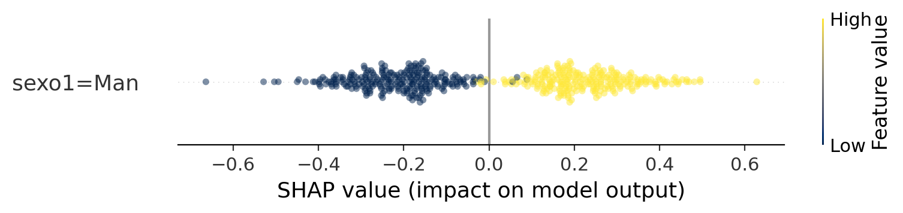
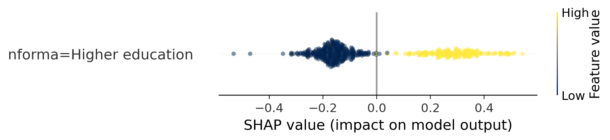
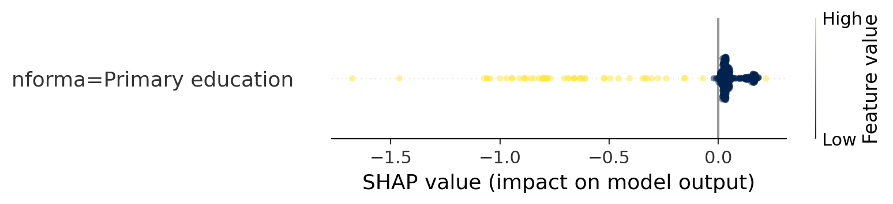
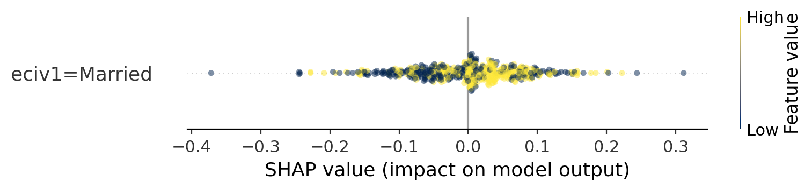
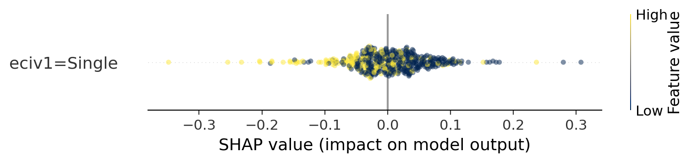
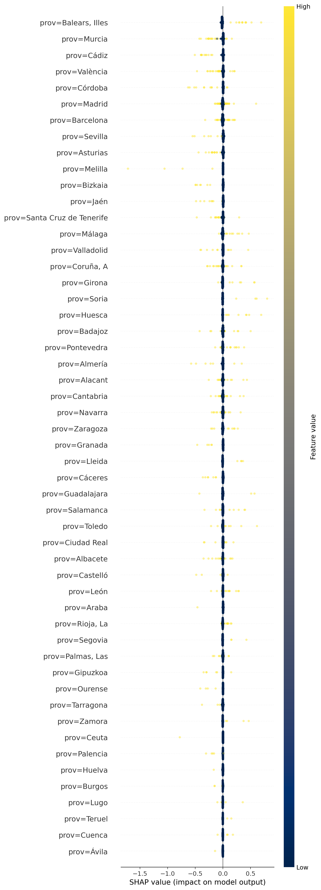

# Labour Force Survey (LFS) Analysis

## Introduction

This project analyzes the [Labour Force Survey](https://www.ine.es/dyngs/Prensa/EPA3T25.htm) (LFS) microdata (downloaded from [ine.es](https://www.ine.es/dyngs/INEbase/es/operacion.htm?c=Estadistica_C&cid=1254736176918&menu=resultados&idp=1254735976595)) from the third quarter of 2025, conducted by the Spanish National Statistics Institute (INE). The primary goal is to identify and understand the sociodemographic and economic factors that most strongly predict employment status.

## Project Structure

- `preprocess.py`: Data preprocessing and cleaning functions
- `process.py`: Data processing and feature engineering
- `model_selection.py`: Model training, evaluation, and selection
- `notebook.py`: Marimo notebook with detailed analysis and visualization

## Key Features

This project leverages advanced machine learning techniques to understand the complex dynamics of employment prediction. We employ two powerful ensemble learning models: Random Forest and XGBoost. These algorithms are particularly well suited for capturing intricate, non-linear relationships within sociodemographic data. 

To ensure transparency and interpretability, we go beyond traditional black box modeling approaches. Our analysis incorporates model interpretability techniques, including feature importance analysis and SHAP (SHapley Additive exPlanations) analysis.

These methods allow us to not just predict employment status, but to understand the precise contributions of each feature to the model's predictions, providing actionable insights into the factors driving employment.

## Data Overview

Our analysis draws from a comprehensive microdata collection of the Labour Force Survey, meticulously compiled by the Spanish National Statistics Institute. The dataset offers a multidimensional view of employment dynamics, capturing crucial sociodemographic and economic characteristics. 

We focus on a rich set of features that provide insights into an individual's employment status. These include geographical context through province identification, demographic information such as age groups and sex, personal circumstances like marital status, and a critical factor in economic opportunity: educational level.

Each of these features serves as a lens through which we can understand the complex ecosystem of employment, revealing how various personal and structural factors intersect to influence an individual's professional trajectory.

## Main Findings

### Top Predictive Features for Employment

Our analysis reveals a landscape of employment predictors, highlighting the multifaceted nature of professional opportunities. Sex emerges as the most significant predictor, with male participants showing a substantially higher probability of employment. This finding underscores persistent gender disparities in the labor market, reflecting deeper structural inequalities.

Education stands as the second most powerful predictor, with higher education levels demonstrating a strong positive correlation with employment. This reinforces the critical role of human capital in accessing professional opportunities, suggesting that investment in education can be a powerful lever for improving employment prospects.

Marital status also reveals intriguing patterns, with married individuals showing a notable advantage in employment probability. This could be interpreted through multiple lenses: as a potential proxy for age and stability, a reflection of social networks, or an indication of broader life circumstances that might influence professional opportunities.

### Charts

### Interpretative Visualizations: SHAP Charts

To transform our statistical findings into a more intuitive narrative, we've developed SHAP (SHapley Additive exPlanations) charts that visually decode the complex interactions between different features and employment probability. These charts serve as a powerful interpretative tool, allowing us to see beyond mere numbers and understand the nuanced dynamics of employment prediction.

In these visualizations, color and position become our storytellers:

- The color tells us whether each elements belongs to the analyzed category:
    * Yellow represents elements within a specific category
    * Blue highlights elements outside the category

- The horizontal axis reveals the feature's impact: 
    * Negative values (left side) indicate a correlation with unemployment
    * Positive values (right side) suggest a stronger likelihood of employment

#### Sex Dynamics


The sex-based SHAP chart illustrates the gender disparities in the labor market, revealing how gender can significantly influence employment opportunities.

#### Educational Pathways



These charts map the transformative power of education, showing how different educational levels can dramatically alter one's employment trajectory.

#### Marital Status Insights



Marital status charts unveil unexpected correlations, suggesting how personal life circumstances might intersect with professional opportunities.

#### Geographical Variations


The provincial SHAP visualization highlights how geographical context can play a subtle yet significant role in employment probabilities.

### Model Performance: Beyond Prediction

Our XGBoost model transcends traditional predictive approaches, offering a sophisticated lens into employment dynamics. By leveraging advanced ensemble learning techniques, we've developed a model that doesn't just predict employment status but provides deep, actionable insights into the complex web of factors driving professional opportunities.

## Dependencies

- Pandas
- Seaborn
- Matplotlib
- XGBoost
- SHAP
- Marimo

## Usage

To run the analysis, ensure you have the required dependencies installed and use the Marimo notebook:

```bash
marimo run notebook.py
```
